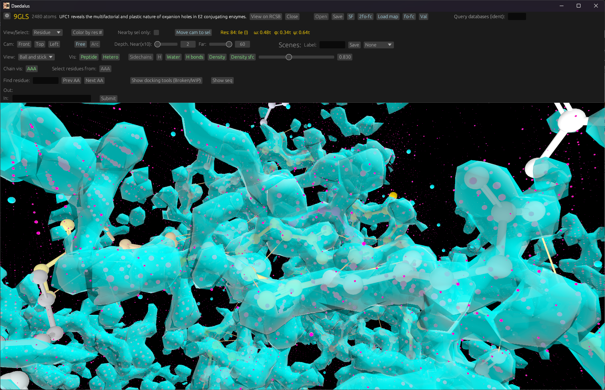
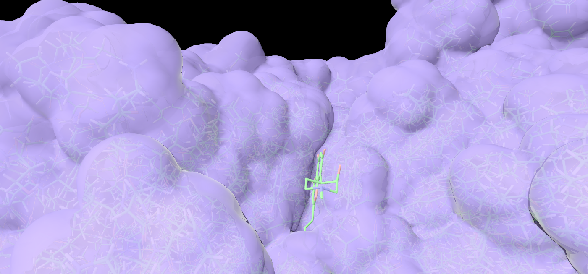
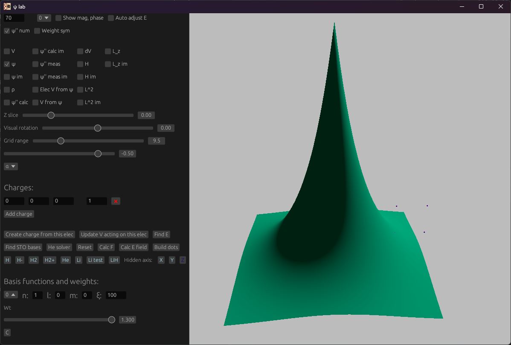
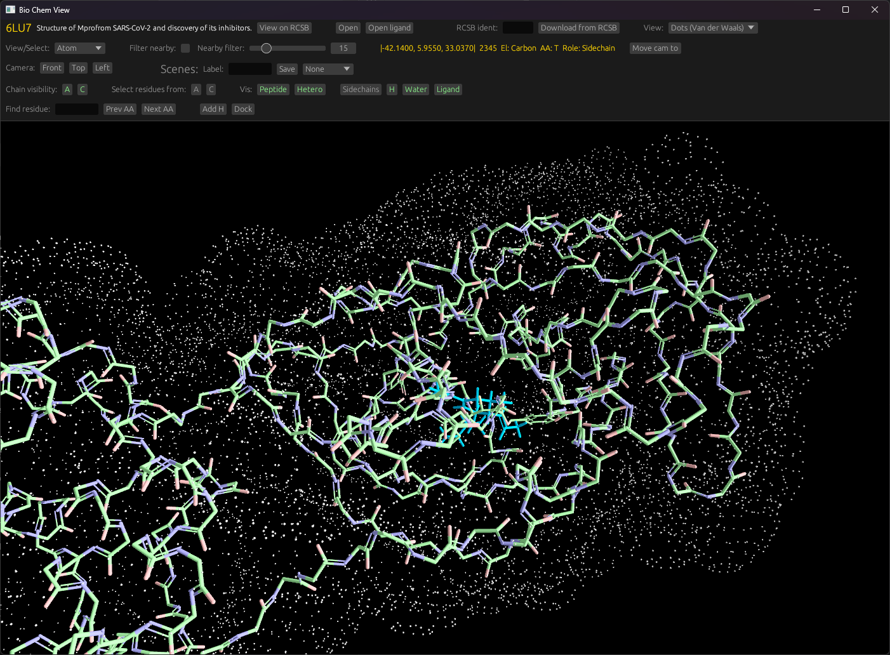

# Graphics
A 3D rendering engine for rust programs, with GUI integration

[](https://crates.io/crates/graphics)
[](https://docs.rs/graphics)

This library is a framework for building PC applications that have 3D graphics, and a GUI. It uses the [WGPU toolkit](https://wgpu.rs/) with Vulkan backend, and [EGUI](https://docs.rs/egui/latest/egui/). 
It works on Windows, Linux, and Mac.

This is intended as a general-purpose 3D visualization tool. Example use cases including wave-function analysis, n-body simulations, 
and protein structure viewing. It's also been used to visualize UAS attitude in preflight software. Its goals are to be intuitive and flexible.

Supports transparent meshes, and gaussians. Includes built-in mesh primitives for spheres, cylinders, and rectangular prisms.
Allows importing and creating arbitrary meshes.




It includes built in FPS-style (Amplified for 6 DOF) camera controls. (WSAD + Space for up, C for down, Q and E for roll.
Mouse for pitch and yaw). This can be overridden by the application with arbitrary controls. (See the `event_handler` parameter to
`graphics::run()`)



It uses the [lin_alg](https://docs.rs/lin_alg/latest/lin_alg/f32/index.html) library for vector, matrix, and quaternion operations.

You can enable the `app_utils` feature for utility functionality that is useful in applications that might use this library, but is not directly related to the GUI.



Example boilerplate below. Calling `render(state)` starts an event loop. The application can interact with the engine 
through the `_handler` callbacks; each frame, each hardware event, or through the GUI. Each of these return an 
`EngineUpdates` struct, which determines if entities, meshes, lighting, or the camera needs to be refreshed.

```rust
//! This module integrations this application with the graphics engine.

use std::f32::consts::TAU;

use graphics::{
    Camera, ControlScheme, DeviceEvent, EngineUpdates, Entity, InputSettings, LightType, Lighting,
    Mesh, PointLight, Scene, UiLayout, UiSettings, GraphicsSettings, RIGHT_VEC, UP_VEC
};
use egui::{Context, Slider, TopBottomPanel};

use lin_alg::f32::{Quaternion, Vec3};

use crate::{playback::change_snapshot, ui::ui_handler, State};

type Color = (f32, f32, f32);

const WINDOW_TITLE: &str = "Causal gravity model";
const WINDOW_SIZE_X: f32 = 1_600.;
const WINDOW_SIZE_Y: f32 = 1_000.;
const BACKGROUND_COLOR: Color = (0.5, 0.5, 0.5);

const RENDER_DIST: f32 = 200.;

pub const BODY_SPHERE_SIZE: f32 = 0.1;
pub const BODY_SHINYNESS: f32 = 2.;
pub const BODY_COLOR: Color = (0., 1.0, 0.5);

/// This runs whenever an event (e.g. keyboard, mouse etc) occurs, and provides information on the event.
fn event_dev_handler(
    state_: &mut State,
    event: DeviceEvent,
    scene: &mut Scene,
    _engine_inputs: bool,
    _dt: f32,
) -> EngineUpdates {
    match event {
        DeviceEvent::MouseMotion { delta } => {
            // let (dx, dy) = delta; // Relative cursor movement
            // println!("Relative cursor position change: dx: {}, dy: {}", dx, dy);
        }
        DeviceEvent::Button { button, state } => {
            if button == 1 {  // Right click
                match state {
                    ElementState::Pressed => {
                        if let Some(cursor) = state_.ui.cursor_pos {
                            let selected_ray = scene.screen_to_render(cursor);

                            let objects_selected = points_along_ray(selected_ray, &objectcs, 1.0);
                        }
                    }
                    ElementState::Released => (),
                }
            }
        }
        _ => (),
    }
    EngineUpdates::default()
}

fn event_win_handler(
    state: &mut State,
    event: WindowEvent,
    _scene: &mut Scene,
    _dt: f32,
) -> EngineUpdates {
    match event {
        WindowEvent::CursorMoved {device_id, position} => {
            state.ui.cursor_pos = Some((position.x as f32, position.y as f32))
        }
        _ => (),
    }
    EngineUpdates::default() 
}

/// This runs each frame.
fn render_handler(_state: &mut State, _scene: &mut Scene, _dt: f32) -> EngineUpdates {
    EngineUpdates::default()
}

const SLIDER_WIDTH: f32 = 460.;
const SLIDER_WIDTH_ORIENTATION: f32 = 100.;

pub const ROW_SPACING: f32 = 22.;
pub const COL_SPACING: f32 = 30.;

fn cam_controls(
    cam: &mut Camera,
    state_ui: &mut StateUi,
    engine_updates: &mut EngineUpdates,
    ui: &mut Ui,
) {
    // todo: Here and at init, set the camera dist dynamically based on mol size.
    // todo: Set the position not relative to 0, but  relative to the center of the atoms.

    let mut changed = false;

    ui.horizontal(|ui| {
        ui.label("Camera:");

        // Preset buttons

        if ui.button("Front").clicked() {
            cam.position = Vec3::new(
                state_ui.mol_center.x,
                state_ui.mol_center.y,
                state_ui.mol_center.z - (state_ui.mol_size + CAM_INIT_OFFSET),
            );
            cam.orientation = Quaternion::new_identity();

            changed = true;
        }

        if ui.button("Top").clicked() {
            cam.position = Vec3::new(
                state_ui.mol_center.x,
                state_ui.mol_center.y + (state_ui.mol_size + CAM_INIT_OFFSET),
                state_ui.mol_center.z,
            );
            cam.orientation = Quaternion::from_axis_angle(RIGHT_VEC, TAU / 4.);

            changed = true;
        }

        if ui.button("Left").clicked() {
            cam.position = Vec3::new(
                state_ui.mol_center.x - (state_ui.mol_size + CAM_INIT_OFFSET),
                state_ui.mol_center.y,
                state_ui.mol_center.z,
            );
            cam.orientation = Quaternion::from_axis_angle(UP_VEC, TAU / 4.);

            changed = true;
        }

        ui.label("Depth:");
        let depth_prev = state_ui.view_depth;
        ui.add(Slider::new(
            &mut state_ui.view_depth,
            VIEW_DEPTH_MIN..=VIEW_DEPTH_MAX,
        ));

        if state_ui.view_depth != depth_prev {

            cam.far = state_ui.view_depth as f32;
            cam.update_proj_mat();
            changed = true;
        }

    });

    if changed {
        engine_updates.camera = true;
    }
}

/// This function draws the (immediate-mode) GUI.
/// [UI items](https://docs.rs/egui/latest/egui/struct.Ui.html#method.heading)
pub fn ui_handler(state: &mut State, ctx: &Context, scene: &mut Scene) -> EngineUpdates {
    let mut engine_updates = EngineUpdates::default();

    TopBottomPanel::top("0").show(ctx, |ui| {
        ui.spacing_mut().slider_width = SLIDER_WIDTH;

        ui.horizontal(|ui| {
            ui.add_space(COL_SPACING);
            ui.label("Time:");

            let snapshot_prev = state.ui.snapshot_selected;
            ui.add(Slider::new(
                &mut state.ui.snapshot_selected,
                0..=state.snapshots.len() - 1,
            ));

            if state.ui.snapshot_selected != snapshot_prev {
                change_snapshot(
                    &mut scene.entities,
                    &state.snapshots[state.ui.snapshot_selected],
                );

                // Or, engine_updates.entities.push_class(EntityClass::MyClass as u32) for 
                // slightly faster updates to a few entities.
                engine_updates.entities = EntityUpdate::All;
            }
        });

        ui.add_space(ROW_SPACING / 2.);
    });

    engine_updates
}


fn draw_entities(entities: &mut Vec<Entity>, snapshots: &[Snapshot]) {
    *entities = Vec::new();
    
    // Alternate way to construct: use its `Default` impl, overriding fields as required.
    entities.push(Entity::new(
        // manually set the `scale_partial` field with a `Vec3` if using non-uniform scaling. 
        Entity::new(
            MESH_BOND, // Index of the mesh.
            center + offset_b,
            orientation, // A quaternion,
            1., // Scale
            BOND_COLOR,
            BODY_SHINYNESS,
        )
    ))
}

/// Entry point to our render and event loop.
pub fn render(state: State) {
    let mut scene = Scene {
        meshes: vec![
            Mesh::new_sphere(1., 3),
            Mesh::from_obj_file("sphere.obj"),
        ],
        entities: Vec::new(), // updated below.
        gaussians: vec![
            Gaussian {
                center: Vec3::new_zero(),
                amplitude: 1.,
                width: 3.,
                color: [1., 0., 0.5, 1.],
            }
        ],
        camera: Camera {
            fov_y: TAU / 8.,
            position: Vec3::new(0., 10., -20.),
            far: RENDER_DIST,
            orientation: Quaternion::from_axis_angle(RIGHT_VEC, TAU / 16.),
            ..Default::default()
        },
        lighting: Lighting {
            ambient_color: [-1., 1., 1., 0.5],
            ambient_intensity: 0.03,
            point_lights: vec![
                // Light from above and to a side.
                PointLight {
                    type_: LightType::Omnidirectional,
                    position: Vec3::new(30., 50., 30.),
                    diffuse_color: [0.3, 0.4, 0.5, 1.],
                    specular_color: [0.3, 0.4, 0.5, 1.],
                    diffuse_intensity: 8_000.,
                    specular_intensity: 30_000.,
                },
            ],
        },
        input_settings: InputSettings {
            control_scheme: ControlScheme::FreeCamera,
            ..Default::default()
        },
        background_color: BACKGROUND_COLOR,
        window_size: (WINDOW_SIZE_X, WINDOW_SIZE_Y),
        window_title: WINDOW_TITLE.to_owned(),
    };

    let ui_settings = UiSettings {
        layout: UiLayout::Top,
        icon_path: Some("./resources/icon.png".to_owned()),
    };

    // Initialize entities.
    if !state.snapshots.is_empty() {
        draw_entities(
            &mut scene.entities,
            &state.snapshots[state.ui.snapshot_selected],
        )
    }

    // This starts the main event loop; program intereactions from here on out will 
    // be handled by one of the `_handler` callbacks defined above.
    graphics::run(
        state,
        scene,
        ui_settings,
        GraphicsSettings::default(),
        render_handler,
        event_dev_handler,
        event_win_handler,
        ui_handler,
    );
}

struct State {} // Set this up however you'd like.

fn main() {
    render(State {});
}
```

You can add overlay text using the entity's `overlay_text` field:
```rust
let mut entity = Entity::new(
    mesh,
    mol.common().atom_posits[i_atom].into(),
    Quaternion::new_identity(),
    radius,
    color,
    ATOM_SHININESS,
);

// Or, use the default `TextOverlay` implementation, and override fields as required.
entity.overlay_text = Some(TextOverlay {
    text: format!("Atom # {}", atom.serial_number),
    size: 14.,
    color: (120, 100, 255, 255),
    font_family: FontFamily::Proportional,
});

entity.class = mol.mol_type().entity_type() as u32;
```


